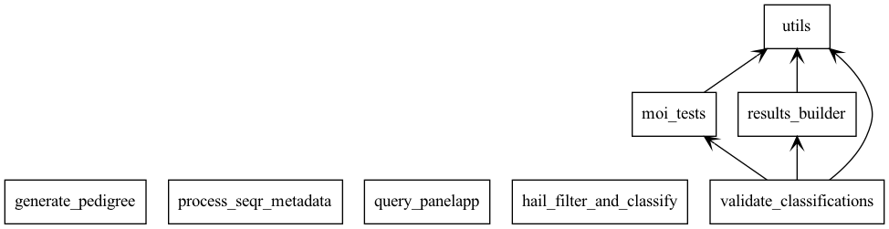

# Design Doc

## Aim

Take in variant data, and run a variant prioritisation algorithm. Highlight a minimal set of variants per sample, based on strict criteria

In general this is focused on True Positives, and is happy to allow False Negatives, making a highly specific actionable dataset, at the potential expense of sensitivity

This is currently in an MVP phase, where the core logic should be accurate but the input and output are only rough drafts

## Concept

This product runs as a single Hail Batch workflow, with a number of Sub-Batches being generated for individual containerised steps. The intended runtime environment is the [analysis-runner](https://github.com/populationgenomics/analysis-runner), which will handle authentication.

1. Query PanelApp to obtain gene lists & MOI data
2. Load variant data in Hail Query, annotate, filter, and assign categories of interest
3. Use Slivar to identify and annotate compound-heterozygous variants within the joint-call
4. Combine categorised data, gene data, and compound hets to variants of interest

This requires pedigree data to describe the family structures. Initially this will be provided using a file, but code is included that can query the [sample metadata](https://github.com/populationgenomics/sample-metadata) API.

Input required:
1. Variant Data in either Hail MatrixTable or VCF format
2. Pedigree
3. Configuration file (default provided in this repo)

Outputs generated:
1. PanelApp data
2. MatrixTable containing annotated, unfiltered data
3. VCF containing annotated categorised variants
4. VCF containing compound-heterozygous variants
5. HTML report of confirmed categorised variants

The outputs will be written to the [CPG GCP bucket](https://github.com/populationgenomics/team-docs/tree/main/storage_policies) corresponding to the cohort being analysed. The intermediate files and outputs will be stored in the project's core bucket, with the report HTML additionally available in the `-web` suffixed bucket 

## Structure

This program is structured using one wrapper script (`reanalysis_wrapper.py`) which defines and submits the worker sub-batches.

Optional (outputs of these scripts can be provided as files):
1. `generate_pedigree.py` - queries the Sample-Metadata API to obtain a sample pedigree for the analysis cohort
2. `process_seqr_metadata.py` - takes cohort metadata from Seqr, outputs a CPG -> Seqr ID lookup

Non-Optional
1. `query_panelapp.py` - Uses requests to obtain panel data from AU PanelApp instance
2. `hail_filter_and_classify.py` - loads variant data in Hail Query, Annotates with VEP and custom categories
3. `SLIVAR` - executed directly as commands within a Slivar container, identifies compound-het variant pairs
4. `validate_classifications.py` - takes all previous results, and runs MOI compatibility tests on all samples & variants in the cohort

### Generate_pedigree.py

Utilises the Sample-Metadata API client library, which requires being executed inside a gcloud authenticated container 

Queries API for all samples in the cohort, as well as the External ID -> CPG ID mapping

Overwrites all member IDs with the CPG internal ID, and exports in PED format

**Optional argument will strip out all family structure and renders as singletons. This is to prevent the Slivar stage from inferring family structure whilst flagging compound hets whilst we are focused on a Singleton-only analysis MVP

