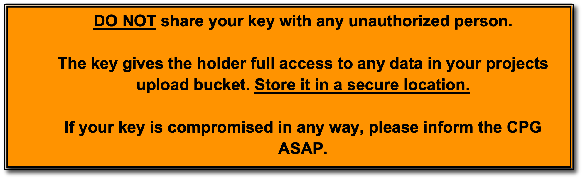

# Uploading your data to CPG's cloud - a quick guide <!-- omit from toc -->


## Table of Contents <!-- omit from toc -->
---

- [1. Background](#1-background)
  - [i. Purpose](#i-purpose)
  - [ii. The Google Cloud Platform](#ii-the-google-cloud-platform)
  - [iii. Requirements](#iii-requirements)
- [2. Authentication](#2-authentication)
- [3. Upload your data](#3-upload-your-data)
- [4. Finishing your transfer](#4-finishing-your-transfer)
- [5. Getting Help](#5-getting-help)

---

<br />

## 1. Background

### i. Purpose

The purpose of this document is to provide easy to follow instructions on how to transfer your genomic data to the CPG’s cloud storage.

<br />

### ii. The Google Cloud Platform

The Centre for Population Genomics currently uses Google’s cloud infrastructure to securely store data before it is ingested into Seqr and our metadata platform.<br />
Each project is compartmentalised into its own corner of the Google cloud platform and named accordingly. <br />Projects are split up into “buckets”, which is Google’s term for storage disk. <br /> <br />
**This document outlines how you can upload your data into the “upload” bucket of your project.**

### iii. Requirements

To successfully upload your data to the cloud bucket, you will need to install two services using the command line.

1.	The Google cloud service for accessing the cloud: `gcloud`
2.	The Google storage utility for accessing the buckets: `gsutil`

-	**For large uploads (i.e., large batches of sequence data) you should access gcloud through your organisation’s server / HPC where your data is stored.**
-	**If gcloud is not already installed in your organisation’s environment, coordinate with your systems administrator to install and activate gcloud.**

To install gcloud and gsutil, [follow these steps](https://cloud.google.com/sdk/docs/downloads-interactive#linux-mac).

&emsp;&ensp;➢	&nbsp;If you are using Mac OS or Linux, you will need to open a terminal session and copy and paste the commands from the instructions in the above link.<br />
&emsp;&ensp;➢	&nbsp;If you are using Windows, you can download an executable installer and follow the prompts to install.

Once you have installed gcloud, you will need to run the command `gcloud init` in a terminal window to successfully start the Google Cloud services command line interface.

<br />

## 2. Authentication

You will have been provided with a service account authorization key. This key, a json file shared via google drive, gives you the permission to upload your data into the bucket for your project.
<br />



1.	Download the key from the Google drive you were provided via email.

&emsp;&emsp;&ensp;&nbsp;The key should have a name like:
“`your-project-upload.json`” or “`your-project-shared.json`”.

<br />

2.	Run the below command to activate your service account key.

```
gcloud auth activate-service-account --key-file your-key-name.json
```

&emsp;&emsp;&ensp; Replace the text “`your-key-name`” with the filename of the key you just downloaded. <br />
&emsp;&emsp;&ensp; If the key is stored in a different directory you will need to use the full path to the key, <br />
&emsp;&emsp;&ensp; e.g.: `path/to/key/your-key-name.json`

<br />

3.	Successfully activating your service account key will produce the output:

```
Activated service account credentials for:
[main-upload@your-project.iam.gserviceaccount.com]
```

<br />

## 3. Upload your data

To upload your data, use the gsutil copy command “`cp`”:

```
gsutil -m cp -r source destination
```

Or use the gsutil remote sync command “`rsync`”:

```
gsutil -m rsync -r source destination
```

**For example**:

```
gsutil -m cp -r /path/to/data gs://cpg-your-project-upload/subdir/date/
```

&emsp;&ensp;➢	&nbsp;Replace `your-project` with the name of your project <br />
&emsp;&ensp;➢	&nbsp;Replace `subdir` with the upload directory specified in the email<br />
&emsp;&ensp;➢	&nbsp;Replace `date` with the upload date (e.g. “2023-01-01”)

<br />

**Note**:	Include the `-m` flag to upload your data faster by using parallel processing. <br />
&emsp;&emsp;&ensp;&ensp;Include the `-r` flag to recursively upload all directories in your data folder.

<br />

## 4. Finishing your transfer

A successful upload should result in the output:

```
Operation completed over n objects/xyz B
```

**Note**:	`n` is the number of files in your uploaded folder. <br />
&emsp;&emsp;&ensp;&ensp;`xyz` is the total size of all the files uploaded

<br />

## 5. Getting Help

If you require assistance with the above steps, contact CPG’s data ingestion coordinator [Edward Formaini](mailto:edward.formaini@populationgenomics.org.au) [edward.formaini@populationgenomics.org.au](mailto:edward.formaini@populationgenomics.org.au)
