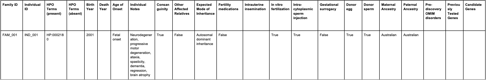

# Organising rare disease data and metadata for seqr <!-- omit from toc -->

## Table of Contents <!-- omit from toc -->

---

- [1. Genomic Data](#1-genomic-data)
- [2. Pedigree\_template](#2-pedigree_template)
- [3. Families\_metadata\_template (Optional)](#3-families_metadata_template-optional)
- [4. Individuals\_metadata\_template](#4-individuals_metadata_template)
- [5. Sample\_mapping\_template](#5-sample_mapping_template)

---

### i. Purpose

The purpose of this document is to provide instructions on how to prepare project specific data and metadata for use in seqr  related to an individual's family history (pedigree).

 

### ii. Background

The CPG utilises four distinct metadata files to provide information about samples to the variant curation team as they   perform variant analysis in seqr.

The four files are described in Table 1.

A template for each of these files is provided in section iii. Quick Links, and instructions for filling out each template  are included in this document.
 
 

#### **Table 1:** Definitions of the metadata files used in rare disease projects <!-- omit from toc -->

|     **Metadata template**    |     **Required**    |     **Description**    |
|:---:|:---:|:---|
|     *Pedigree_template*    |     **Yes**    |     Template file used to describe the individuals in each dataset  and how they relate to other individuals in  the same dataset, mainly their parents.  The information in this file is used to generate  the participant pedigrees*.    |
|     *Families_metadata_template*    |     No    |     Template file used to describe the families in each dataset. |
|     *Individuals_metadata_template*    |     **Yes**    |     Template file used to describe the clinical information  related to individuals in each dataset. |
|     *Sample_mapping_template*    |     **Yes**    |     Template file used to map individual IDs AND sample IDs  back to the files that have been transferred. |

*A pedigree is a structured description of the phenotypical and familial relationships between samples.

The CPG uses the tool ‘GATK HaplotypeCaller’, which can incorporate pedigree information in the genomic analysis of samples.

 

### iii. Quick Links

1. [Excel templates](excel_templates/) 
2. [csv templates](csv_templates/) 
3. [tsv templates](tsv_templates/) 
4. [Template data dictionaries](Template_data_dictionaries)

 
 

## 1. Genomic Data

1.1     CPG’s bioinformatic pipelines use the following genomic data types:

- FASTQ files
- CRAM files
- BAM files

**Note:** CPG's preference is to use FASTQ files. In the absence of FASTQ files, BAM or CRAM files can be transferred.

1.2.&emsp;For each FASTQ/BAM/CRAM file that is to be transferred, a corresponding MD5 file also needs to be transferred,   &emsp;&emsp;&ensp;for data integrity QC to occur after the transfer.

1.3.&emsp;Ensure that the genomic data files are transferred to a specific directory in the CPG’s cloud storage.  &emsp;&emsp;&ensp;Appropriate directories include the date of the transfer in the directory path.

1.4.&emsp;Further instructions can be found in this document:
[Uploading your data to CPG cloud](../README.md)

 
 

## 2. Pedigree_template

**Note**: The Individual_ID is used by CPG to internally track individuals.    &emsp;&emsp;&ensp;&ensp;If a new Individual_ID is provided in the metadata, a new individual will be created within our system.   &emsp;&emsp;&ensp;&ensp;If providing new data for individuals that have already been included in metadata previously sent to CPG,   &emsp;&emsp;&ensp;&ensp;please use the exact same Individual_ID.

2.1.&emsp;Download the *pedigree_template* file from the CPG Rare-Disease github repository.
1. [Excel template](excel_templates/pedigree_template.xlsx) 
2. [csv template](csv_templates/pedigree_template.csv) 
3. [tsv template](tsv_templates/pedigree_template.tsv) 

2.2.&emsp;Information relating to **all** individuals should be documented in a single *pedigree_template* file.  &emsp;&emsp;&ensp;&nbsp;If an individual appears in the Paternal ID or Maternal ID column, then that individual needs their own dedicated row.

**Note**: You should only have one *pedigree_template* file.  &emsp;&emsp;&ensp;&ensp;This single file can contain as many individuals as described in your cohort/dataset.  &emsp;&emsp;&ensp;&ensp;Do not create separate *pedigree_template* files for each individual in your cohort/dataset.

2.3.&emsp;Populate the *pedigree_template* according to Table 2.  
&emsp;&emsp;&ensp;&nbsp;An example is given below in Table 3.

2.4.&emsp;Ensure that the *pedigree_template* file is shared alongside your transfer.
 
 

#### **Table 2:** Data dictionary for pedigree_template file describing inputs for template fields <!-- omit from toc -->

| **Field label** | **Allowed Values** | **Notes** |
|:---:|:---:|:---|
| Family ID | Alphanumeric family ID | The combination of family and individual ID  should uniquely identify a person.    |
|     Individual ID    |     Alphanumeric individual   ID    | The combination of family and individual ID  should uniquely identify a person. |
|     Paternal ID    |     Alphanumeric paternal ID    | Individuals without parental data can use a 0  in this column or leave it blank. |
|     Maternal ID    |     Alphanumeric maternal ID    | Individuals without parental data can use a 0  in this column or leave it blank. |
|     Sex    | 0 = unknown 1 = male 2 = female | If an individual's sex is unknown, a 0 should  be used in this column. |
|     Affected Status    | -9 = missing 0 = missing 1 = unaffected 2 = affected | Either -9 or 0 can be used to denote a  missing affected status for an individual.    |

 
 

#### **Table 3:** Example of a populated pedigree_template file. <!-- omit from toc -->

| **Family ID** | **Individual ID** | **Paternal ID** | **Maternal ID** | **Sex** | **Affected Status** |
|---|---|---|---|---|---|
|     FAM_001    |     IND_001    |     IND_003    |     IND_002    |     1    |     2    |
|     FAM_001    |     IND_002    |          |          |     2    |     1    |
|     FAM_001    |     IND_003    |          |          |     1    |     2    |
|     FAM_002    |     IND_004    |          |     IND_005    |     2    |     2    |
|     FAM_002    |     IND_005    |          |          |     2    |     2    |

 
 

## 3. Families_metadata_template (Optional)

3.1.&emsp;Download the *families_metadata_template* file from the CPG Rare-Disease github repository.
1. [Excel template](excel_templates/families_metadata_template.xlsx) 
2. [csv template](csv_templates/families_metadata_template.csv) 
3. [tsv template](tsv_templates/families_metadata_template.tsv) 

3.2.&emsp;All information relating to families should be documented in a single *families_metadata_template* file.

**Note**: You should only have **one** *families_metadata_template* file.  &emsp;&emsp;&ensp;&ensp;This single file can contain as many families as described in your cohort/dataset.  &emsp;&emsp;&ensp;&ensp;Do not create separate *families_metadata_template* files for each family in your cohort/dataset.

3.3.&emsp;Populate the *families_metadata_template* according to Table 4. 
&emsp;&emsp;&ensp;&nbsp;An example is given below in Table 5.

3.4.&emsp;Ensure that the *families_metadata_template* file is shared alongside your transfer.

 

#### **Table 4:** Data dictionary for families_metadata_template file describing inputs for the template fields <!-- omit from toc -->

| **Field label** | **Allowed Values** | **Notes** |
|:---:|:---:|:---|
| Family ID | Alphanumeric family ID | The family ID should uniquely identify a family.    |
|     Display Name   |     Alphanumeric Characters    | An optional secondary identifier. |
|     Description    |     Alphanumeric Characters   | Clinical description of the family |
|     Coded Phenotype    |     Comma-separated list of HPO codes for  phenotypes present in this family    | Coded clinical phenotypes related to the clinical   description of the family, preferably in HPO terms. |

 
 

#### **Table 5:** Example of a populated families_metadata_template file. <!-- omit from toc -->

| **Family ID** | **Display Name** | **Description** | **Coded Phenotype** |
|---|---|---|---|
| FAM_001    |  | Neurodegeneration, progressive motor degeneration,  ataxia, spasticity, dementia, regression, brain atrophy | HP:0002180 |
| FAM_002 |  | Dilated cardiomyopathy, leukodystrophy | HP:0002415, HP:0001644 |

 
 

## 4. Individuals_metadata_template

4.1.&emsp;Download the *individuals_metadata_template* file from the CPG Rare-Disease github repository.
1. [Excel template](excel_templates/individuals_metadata_template.xlsx) 
2. [csv template](csv_templates/individuals_metadata_template.csv) 
3. [tsv template](tsv_templates/individuals_metadata_template.tsv) 

4.2.&emsp;All information relating to individuals should be documented in a single *individuals_metadata_template* file.

**Note:** You should only have **one** *individuals_metadata_template* file.  &emsp;&emsp;&ensp;&ensp;This single file can contain as many individuals as described in your cohort/dataset.  &emsp;&emsp;&ensp;&ensp;Do not create separate *individuals_metadata_template* files for each family in your cohort/dataset.

4.3.&emsp;Populate the *individuals_metadata_template* according to Table 6. 
&emsp;&emsp;&ensp;&nbsp;An example is given below in Table 7.

**Note**: Only populate the fields that you have information for. Not every field needs to be populated in this template file.   &emsp;&emsp;&ensp;&ensp;The more information you provide in the file, the better your experience will be in seqr.

4.4.&emsp;Ensure that the *individuals_metadata_template* file is shared alongside your transfer.

 

#### **Table 6:** Data dictionary for individuals_metadata_template file describing inputs for the template fields. <!-- omit from toc -->

| **Field label** | **Allowed Values** | **Notes** |
|:---:|:---:|:---|
| Family ID | Alphanumeric family ID | The   combination of family ID and individual ID should   uniquely identify an individual. |
| Individual ID | Alphanumeric individual ID |  |
| HPO Terms (present) | Comma-separated list of HPO codes for   phenotypes present in this individual | This field should have the HPO codes, not the descriptions. |
| HPO Terms (absent) | Comma-separated list of HPO codes for    phenotypes not present in this individual | This field should have the HPO codes, not the descriptions. |
| Birth Year | Numeric year of birth. E.g. 2010 | If you have collected a DOB, e.g. 01-01-2001,   please only include the **year** component. |
| Death Year | Numeric year of death, if applicable.   Leave blank otherwise. | If you have collected a DOD, e.g. 01-01-2001,   please only include the **year** component. |
| Age of Onset | **One of the following:**   Embryonal onset, Congenital onset,  Fetal onset,  Neonatal onset,  Infantile onset,  Childhood onset,  Juvenile onset,  Adult onset,  Young adult onset,  Middle age onset,  Late onset | *This is a rough suggestion, with no clinical source.*   **Embryonal onset:** conception to 8 wks gestation   **Fetal onset:** 9 wks gestation to birth  **Congenital onset:** conception to birth   **Neonatal onset:** birth to 1 month,   **Infantile onset:** birth to 1 year  **Childhood onset:** < 5 years  **Juvenile onset:** < 17 years  **Young adult onset:** < 25 years  **Adult onset:** < 36 years  **Middle age onset:** < 55 years  **Late onset:** > 55 years
| Individual Notes | Alphanumeric characters |   |
| Consanguinity | true, false, or blank if unknown |   |
| Other Affected Relatives | true, false, or blank if unknown |   |
| Expected Mode of Inheritance | **Comma-separated list of the following:**  Sporadic,  Autosomal dominant inheritance,  Sex-limited autosomal dominant,  Male-limited autosomal dominant,  Autosomal dominant contiguous gene syndrome,  Autosomal recessive inheritance, Gonosomal inheritance,  X-linked inheritance,  X-linked recessive inheritance,  Y-linked inheritance,  X-linked dominant inheritance,  Multifactorial inheritance,  Mitochondrial inheritance |   |
| Fertility Medications | true, false, or blank if unknown |   |
| Intrauterine Insemination | true, false, or blank if unknown |   |
| In Vitro Fertilization | true, false, or blank if unknown |   |
| Intra-Cytoplasmic Sperm Injection | true, false, or blank if unknown |   |
| Gestational Surrogacy | true, false, or blank if unknown |   |
| Donor Egg | true, false, or blank if unknown |   |
| Donor Sperm | true, false, or blank if unknown |   |
| Maternal Ancestry | comma-separated list of ethnicities |   |
| Paternal Ancestry | comma-separated list of ethnicities |   |
| Pre-discovery OMIM disorders | comma-separated list of valid OMIM numbers |   |
| Previously Tested Genes | comma-separated list of genes |   |
| Candidate Genes | comma-separated list of genes |   |

 
 

#### **Table 7:** Example of a populated individuals_metadata_template file. <!-- omit from toc -->

 
 

## 5. Sample_mapping_template

5.1.&emsp;Download the *sample_mapping_template* file from the CPG Rare-Disease github repository.
1. [Excel template](excel_templates/sample_mapping_template.xlsx) 
2. [csv template](csv_templates/sample_mapping_template.csv) 
3. [tsv template](tsv_templates/sample_mapping_template.tsv) 

5.2.&emsp;Populate the *sample_mapping_template* file according to Table 8.  
&emsp;&emsp;&ensp;&nbsp;An example is given below in Table 9.

5.3.&emsp;Ensure that the *sample_mapping_template* file is shared alongside your transfer.

 

#### **Table 8:** Data dictionary for sample_mapping_template file describing inputs for the template fields <!-- omit from toc -->

| **Field label** | **Allowed Values** | **Notes** |
|:---:|:---:|---|
| Individual ID | Alphanumeric individual ID  (if different to the Sample ID)    | This column can be left blank if the  individual ID and the sample ID are  identical.    |
| Sample ID | Alphanumeric sample ID    | A sample ID should be unique within a  project. Note that an individual can have  multiple samples.    |
| Filenames | Comma-separated list of filenames for this sample.    | If more than two files are provided, they  will be grouped automatically    |
| Type | One of the following: WGS, WES    | WGS (whole-genome), or  WES (whole-exome) sequencing.  ***If this field is blank***  **the type will default to WGS.**   **Note**: If a sample has both WES and WGS  sequence data, you should include a row  for each type.    |

 
 

#### **Table 9:** Example of a populated sample_mapping_template file. <!-- omit from toc -->

| **Individual ID** | **Sample ID** | **File names** | **Type** |
|---|---|---|---|
| IND_001    | A0001 | A0001-R1.fastq.gz, A0001-R2.fastq.gz    | WGS    |
| IND_001    | A0001    | A0001_WES-R1.fastq.gz, A0001_WES-R2.fastq.gz    | WES    |
| IND_002    | A0002    | A002-R1.fastq.gz, A0002-R2.fastq.gz    | WGS    |

 
 
